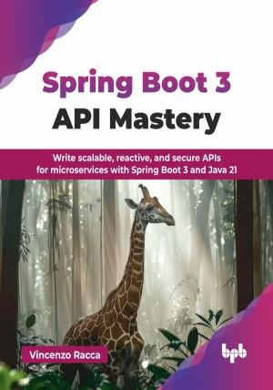

# Spring Boot 3 API Mastery

Write scalable, reactive, and secure APIs for microservices with Spring Boot 3 and Java 21.

This is the repository for [Spring Boot 3 API Mastery
](https://bpbonline.com/products/spring-boot-3-api-mastery-1?variant=44480032080072),published by BPB Publications.

## About the Book
This book is a complete guide to designing and implementing scalable, secure, and modern APIs in a microservices architecture. Covering both synchronous communication via REST, GraphQL, and gRPC, as well as asynchronous communication with Kafka, it equips you with the tools to build efficient, reliable, and observable APIs.

Learn best practices for designing REST APIs, including HTTP verb usage and the API-first approach. Explore Spring Boot technologies like WebFlux and virtual threads to build scalable REST APIs. The book also demonstrates how to use Spring Cloud Stream for broker-agnostic asynchronous communication to build robust event-driven architectures.

To ensure observability, you will implement logging, monitoring, and tracing with Grafana, Prometheus, and Tempo. Security is key, and the book covers OAuth2 and OpenID Connect using Spring Security and Keycloak for centralized authentication. Finally, discover how to deploy microservices with Docker and Kubernetes, mastering containerization and orchestration.

## What You Will Learn
• Design scalable, secure REST APIs with Spring Boot, WebFlux, and virtual threads.

• Implement GraphQL and gRPC for modern APIs.

• Master asynchronous communication with Kafka and Spring Cloud Stream.

• Achieve observability with logging, metrics, and distributed tracing.

• Deploy microservices on Docker and Kubernetes with ease.
